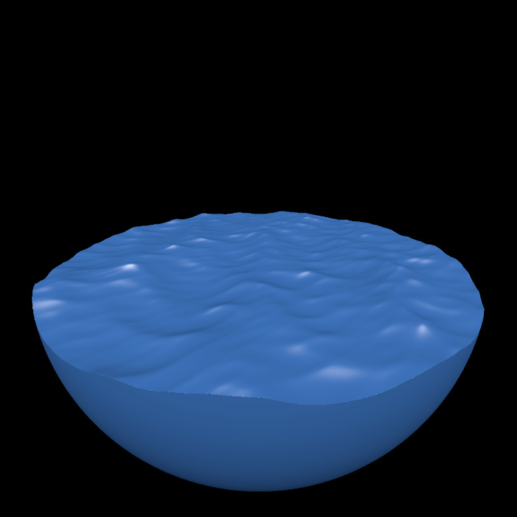

# sdf-playground

Signed distance functions + Rust (CPU & GPU) = ❤️❤️

<p align="center">
  
</p>

Platforms: Windows, Mac & Linux.

## About

sdf-playground is a demo showcasing how you can run Rust code on the GPU - it
consists of two parts:

- the application (run on the CPU, inside `./app`),
- the shader (run on the GPU, inside `./shader`).

Application is responsible for spawning the window and telling GPU to execute
the shader, while shader is the one which generates all the colors.

Shader here implements a ray-marcher for signed distance functions, but in
principle it can be anything you want, e.g.:

``` rust
#[spirv(fragment)]
pub fn main_fs(out_color: &mut Vec4) {
    // out_color.x = R (0..1)
    // out_color.y = G (0..1)
    // out_color.z = B (0..1)
    // out_color.w = alpha (technically 0..1, but actually unused here)

    // Renders a yellow rectangle
    *out_color = vec4(1.0, 1.0, 0.0, 1.0); 
}
```

## Usage

```
$ git clone https://github.com/Patryk27/sdf-playground
$ cargo run --release
# (might take a few minutes the first time, but should be faster then)
```

Note that the code first builds the application, then starts it, and then builds
the shader - so for a few moments (until the shader is ready), the window will
be just pitch-black (you should be able to see the shader's compilation progress
in the terminal, though).

On the upside, modifying the shader doesn't require restarting the application -
simply change `shader/src/lib.rs`, save it and wait a few seconds for the
application to refresh!

## Caveat Emptor

rust-gpu (the software that compiles your Rust code into a shader) doesn't 
support all features of the Rust language:

- understandably, there's no standard library (no `std::fs`, no `vec![]` etc.),
- there's no support for ADTs (no `enum Option<T> { Some(T), None }` etc.),
- stick to `bool`, `u8`, `u32` and `f32` - other types (might) not work,
- miscompilations are possible, though unlikely.

## License

MIT License

Copyright (c) 2023 Patryk Wychowaniec
